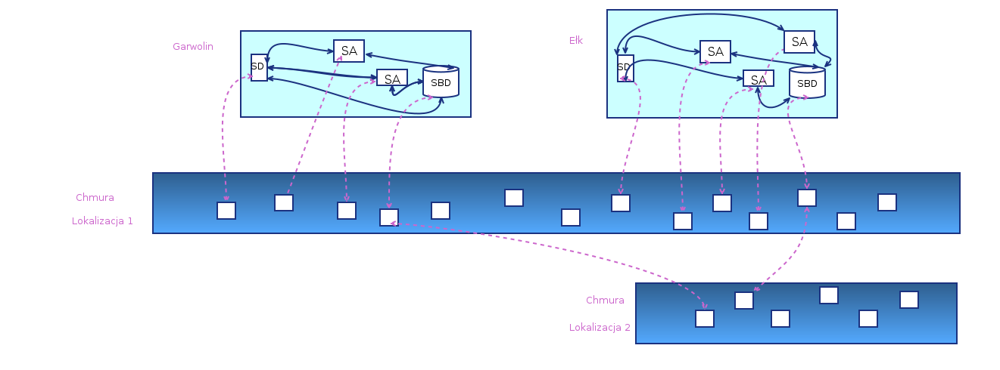
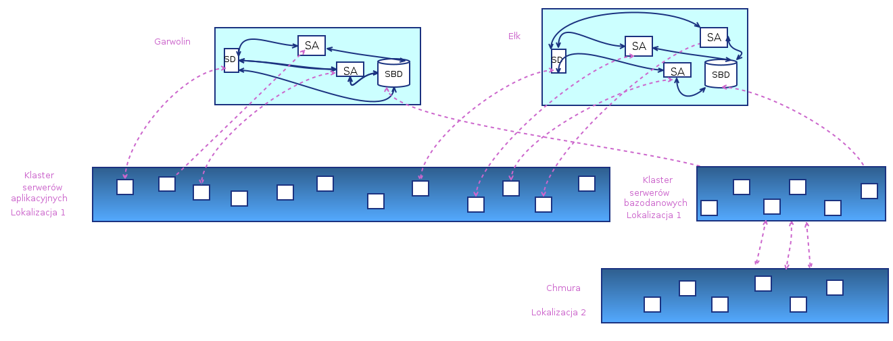

## Bazy danych instancji

<em> Kilka uwag</em>

### 1. Hipoteza: Baza danych == instancja ?

Z punktu widzenia platformy, na której realizowane są usługi, "instancja" jest kolekcją serwerów (lub instancji kontenerów Dockera), które są do tej instancji przypisane.

Fakty:
- serwery aplikacyjne są bezstanowe i w dowolnym momencie mogą być tworzone lub kasowane (zakładając, że jest przechowywany ich gotowy obraz). W szczególności, jeśli wzrasta obciążenie usługi, można uruchomić nowe serwery aplikacyjne albo zwolnić je, jeśli przestają być niezbędne
- inaczej jest z serwerami BD: baza danych jakiegoś użytkownika przechowuje trwale jego dane i potrzebne jest zabezpieczenie zawartości bazy danych; planowaliśmy do tego użycie mechanizmu replikacji na innym serwerze fizycznym.

Plan pierwotny:
- każda instancja miałaby osobny serwer BD
- jeśli dopuścilibyśmy używanie różnych systemów BD, to mogłoby się okazać, że nie mogą być posadowione na tym samym serwerze (wymaganie zgodności wersji itp.)

Opinie:
- niektórzy specjaliści zdecydowanie odradzali nam rozwiązanie, w którym jedna baza danych obsługuje kilka instancji (np. wspólna baza Garwolina, Nowego Sącza i Suwałk). Uważają, ze separacja jest bardzo korzystna, gdyż wszelkie problemy pojawiające się w jakiejś bazie nie infekują baz innych uzytkowników.
- z kolei administratorzy aplikacji i sieci w urzędach ostrzegają przed zakładaniem wielu instancji baz danych — obsługa wielu instancji jest kłopotem.

#### Propozycja innej architektury

### 2. Ograniczenia rodzajów baz danych ?

Jako serwer SQL można wybrać PostgreSql albo MySql, jako najbardziej renomowane systemy.

Ale czy można tak stawiać zagadnienie ?
Tak można pytać, gdy mamy do napisania jakąś aplikację i potrzebujemy w niej użyć bazy danych.

Tu sytuacja jest inna. Tworzymy platformę. Czy naprawdę chcemy ogłosić, że na tej platformie bedą mogły działać tylko aplikacje używające PostgreSql, w dodatku o pewnej określonej wersji ?

### 3. Ograniczenia rodzajów serwerów ?

Podobnie można powiedzieć o ograniczeniach rodzajów systemów plików i samych serwerów.
Twórcy aplikacji pisanych na serwery MS będą na pewno krytykować, jeśli będą dostępne tylko serwery Linux.

